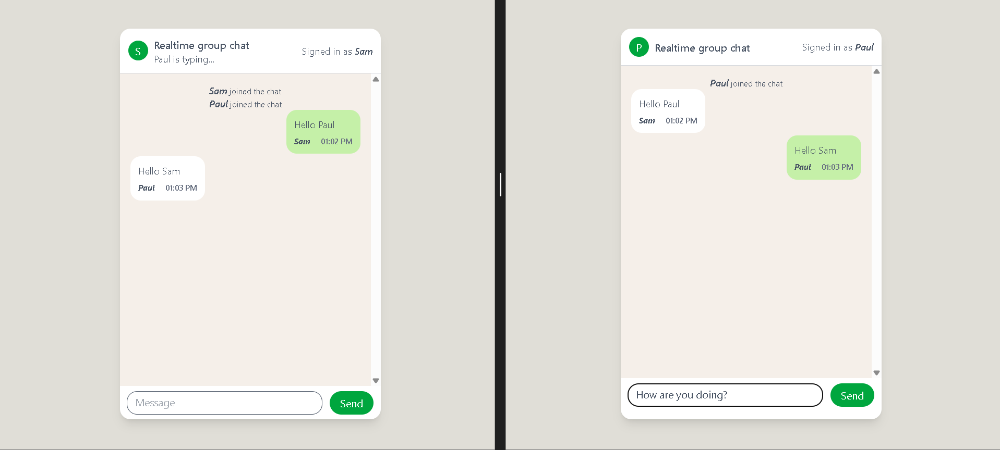
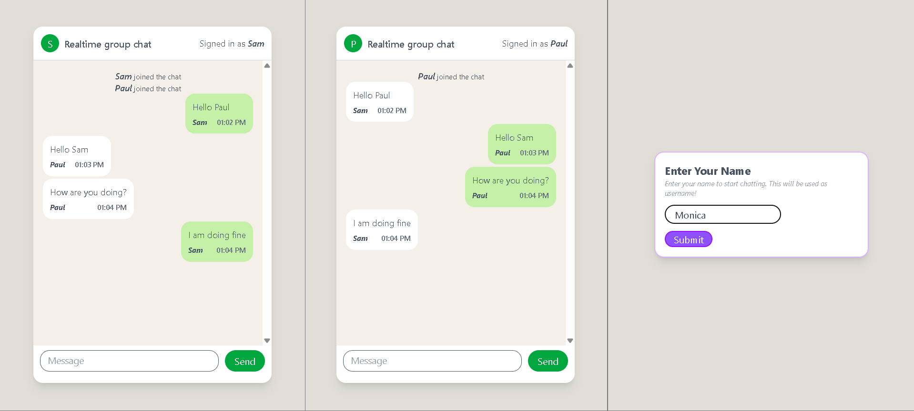
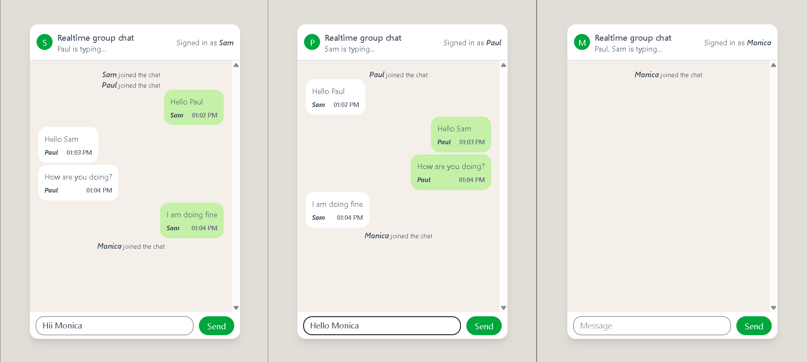
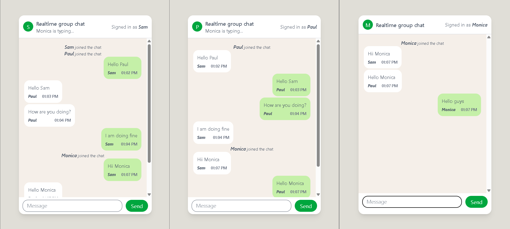

# ChatUsingWebsockets

A real-time group chat application built with React.js and Socket.IO.

## Screenshots

### Two-User Chat — Real-Time Messaging & Typing Indicator

*Sam and Paul exchanging messages in real time. The typing indicator ("Paul is typing...") appears live in Sam's view.*

### Multi-User Join & Name Entry

*Monica enters her name via the sign-in prompt to join the existing Sam–Paul conversation. All participants see a "Monica joined the chat" notification.*

### Three-User Typing Indicators

*With three active participants, each window shows who else is currently typing (e.g. "Paul, Sam is typing..." in Monica's view).*

### Three-User Full Conversation

*Full three-way conversation showing message alignment: the current user's messages appear on the right (green), and other participants' messages appear on the left (white).*

---

## Features

- **Real-time Messaging:** Send and receive messages instantly in a shared group chat room.
- **Join Notifications:** Automatically broadcasts a system message (e.g. *"Monica joined the chat"*) to all connected users when a new participant joins.
- **Typing Indicators:** Displays a live "*User is typing...*" indicator — with debouncing to automatically clear it when the user stops typing. In rooms with multiple active typers, all names are shown (e.g. *"Paul, Sam is typing..."*).
- **Username Sign-In:** A name-entry prompt greets new users before they enter the chat. The chosen name serves as their username and is displayed on their avatar throughout the session.
- **Message Alignment:** Your own messages appear right-aligned in green; messages from others appear left-aligned in white, matching the familiar messaging-app convention.
- **Scrollable Chat History:** The message area is independently scrollable, keeping the input bar always accessible regardless of chat length.

---

## Tech Stack

- **Frontend:** React.js (via Vite), Tailwind CSS, `socket.io-client`
- **Backend:** Node.js, Express.js, `socket.io`

---

## Project Structure

```
chatapp/
├── screenshots/                # README screenshots
│   ├── img4.png
│   ├── img6.png
│   ├── img7.png
│   └── img8.png
├── app/                        # Frontend (React + Vite)
│   └── src/
│       ├── assets/             # App assets (processed by Vite)
│       ├── components/         # React components
│       ├── App.js              # Root application component
│       └── index.js            # Entry point
├── server/
│   └── server.js               # Express + Socket.IO backend (port 4600)
└── README.md
```

---

## How to Run

### 1. Start the Backend Server

```bash
cd server
npm install
node server.js
```

The server will start and listen on **port 4600**.

### 2. Start the Frontend Application

```bash
cd app
npm install
npm run dev
```

Open the URL shown in your terminal (typically `http://localhost:5173`) in **multiple browser tabs or windows** to simulate multiple users chatting in real time.
